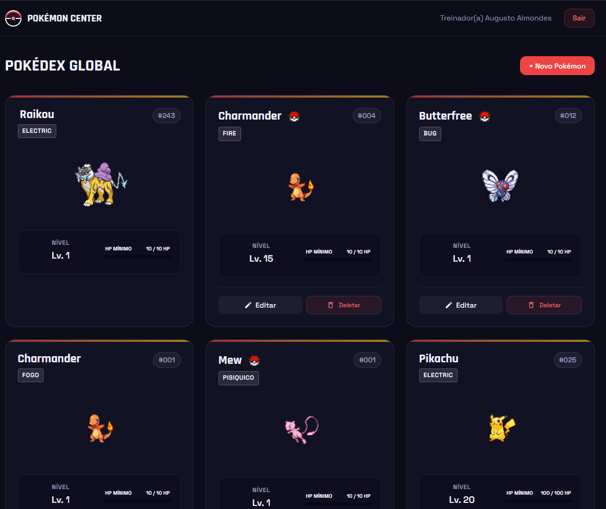
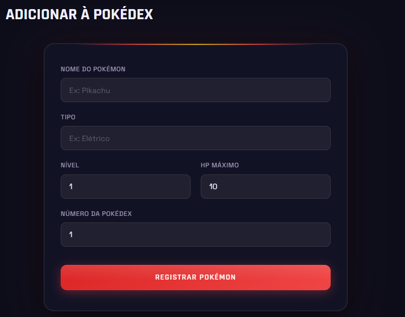
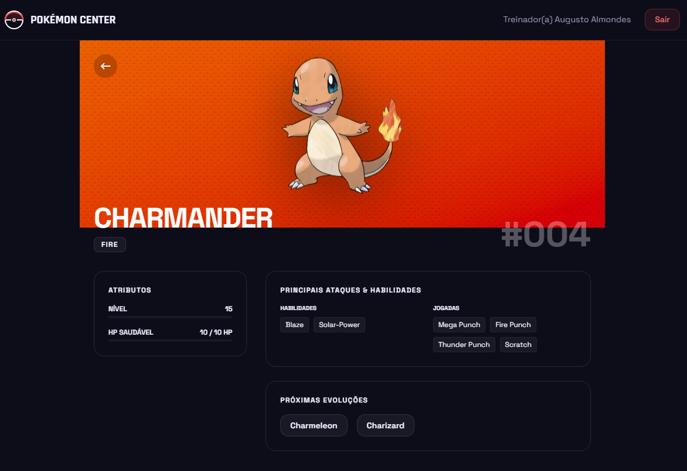

# 🏥 Pokemon Center

Uma plataforma completa para gerenciamento de Pokémons, permitindo que treinadores registrem, visualizem e gerenciem sua coleção de forma eficiente e intuitiva.



# 📝 Descrição

O **Pokemon Center** é um ecossistema desenvolvido para resolver a necessidade de organização de dados de Pokémons capturados. O projeto integra dados oficiais da PokeAPI para validação e enriquecimento de informações, oferecendo uma interface moderna e amigável.

- **Problema:** Dificuldade em manter um registro organizado e visual de Pokémons com stats personalizados.
- **Público-alvo:** Desenvolvedores que buscam um exemplo de aplicação Full Stack robusta e entusiastas de Pokémon.
- **Funcionamento:** O sistema utiliza um backend em NestJS para gerenciar autenticação (JWT) e persistência de dados, enquanto o frontend em Next.js proporciona uma experiência de usuário dinâmica e responsiva.

# 🚀 Demonstração

Aproveite para conferir o projeto em operação:

- **Frontend (Vercel):** [Visualizar App](https://pokemon-center-ashy.vercel.app/)
- **Backend (Render):** [API Endpoint](https://pokemon-center-hwim.onrender.com)

# ✨ Funcionalidades

- **🔒 Autenticação Segura:** Sistema de login e registro com JWT.
- **📊 Dashboard Interativo:** Visualização geral da sua coleção com cards detalhados.
- **🔍 Integração com PokeAPI:** Busca automática de dados oficiais durante o cadastro.
- **📝 Gerenciamento Completo (CRUD):** Criação, leitura, atualização e exclusão de Pokémons.
- **📱 Design Responsivo:** Experiência otimizada para dispositivos móveis e desktop.



# 🛠️ Tecnologias Utilizadas

### Frontend
- **Framework:** Next.js 15+ (App Router)
- **Estilização:** Tailwind CSS & Shadcn UI
- **Validação:** React Hook Form & Zod
- **Ícones:** React Icons & Lucide React

### Backend
- **Framework:** NestJS
- **ORM:** Prisma
- **Autenticação:** Passport.js & JWT
- **Linguagem:** TypeScript

### Banco de Dados & Outros
- **Banco:** PostgreSQL (Supabase)
- **Hospedagem:** Vercel (Frontend) & Render (Backend)

# ⚙️ Como Rodar o Projeto

### Pré-requisitos
- Node.js instalado (v18+)
- Gerenciador de pacotes `pnpm` (recomendado) ou `npm`

### 1. Clonar o Repositório
```bash
git clone https://github.com/AugustoAlmondes/Pokemon-center.git
cd Pokemon-center
```

### 2. Configurar o Backend
```bash
cd backend
pnpm install
# Configure as variáveis de ambiente no arquivo .env (veja abaixo)
pnpm run start:dev
```

### 3. Configurar o Frontend
```bash
# Em um novo terminal, na raiz do projeto:
cd frontend
pnpm install
# Configure as variáveis de ambiente no arquivo .env
pnpm run dev
```

# 🔑 Variáveis de Ambiente

Crie um arquivo `.env` em ambas as pastas:

**No diretório /backend:**
```env
DATABASE_URL="sua_url_do_postgresql"
DIRECT_URL="sua_url_direta_do_postgresql"
JWT_SECRET="sua_chave_secreta"
PORT=3030
```

**No diretório /frontend:**
```env
NEXT_PUBLIC_API_URL="http://localhost:3030"
NEXT_PUBLIC_POKEAPI_URL="https://pokeapi.co/api/v2"
```

# 📂 Estrutura do Projeto

```text
Pokemon-center/
├── backend/           # API desenvolvida com NestJS
│   ├── src/           # Código-fonte (Módulos, Controllers, Services)
│   ├── prisma/        # Schema e Migrations do banco de dados
│   └── ...
├── frontend/          # SPA desenvolvida com Next.js
│   ├── app/           # Páginas e rotas da aplicação
│   ├── components/    # Componentes de UI reutilizáveis
│   └── ...
└── images/            # Assets de documentação
```



# 🔮 Melhorias Futuras

- [ ] Implementação de sistema de batalhas entre Pokémons cadastrados.
- [ ] Upload de imagens personalizadas para os Pokémons.
- [ ] Filtros avançados por tipo, nível e poder no Dashboard.
- [ ] Exportação de relatórios em PDF/CSV.

# 👤 Autor

**Augusto Almondes**

- GitHub: [@AugustoAlmondes](https://github.com/AugustoAlmondes)
- LinkedIn: [Augusto Almondes](https://www.linkedin.com/in/augusto-almondes/)

---
✨ Desenvolvido com dedicação para a comunidade Pokémon!
